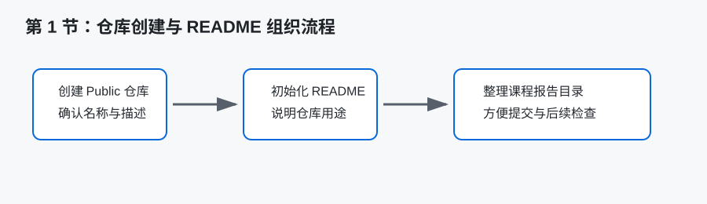
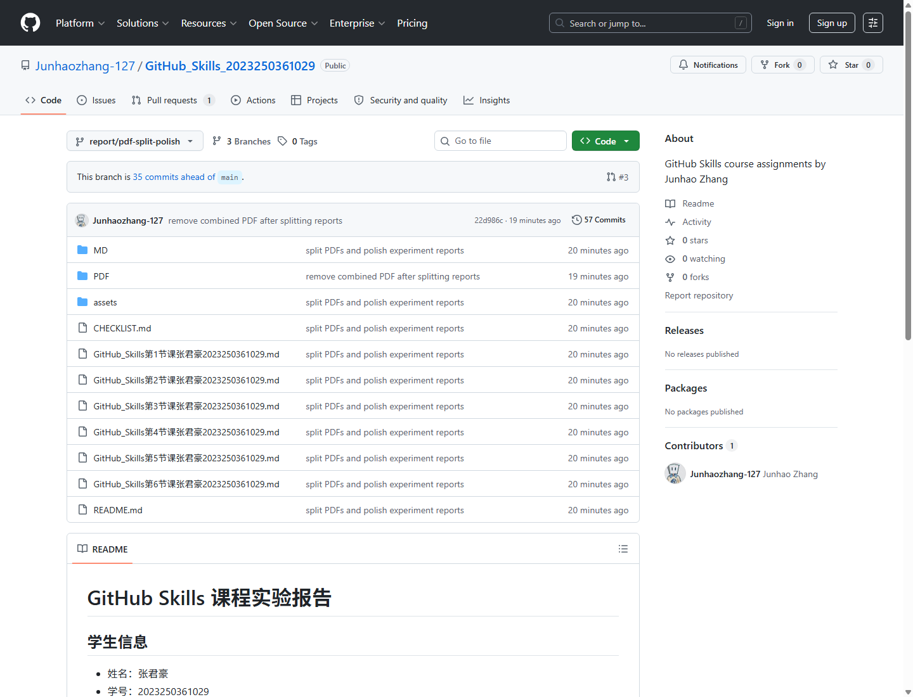

# GitHub Skills 第 1 节课实验报告

## 一、基本信息

- 姓名：张君豪
- 学号：2023250361029
- 班级：软件2301B1
- 作业完成日期：________

## 二、核心知识点梳理

本节课的重点是认识 Git、GitHub 和仓库的基本概念，并完成课程作业仓库的创建。Git 是一种分布式版本控制工具，主要用于记录文件变化、回退历史版本、比较不同版本之间的差异。GitHub 则是基于 Git 的代码托管与协作平台，它不仅可以保存仓库，还提供 Pull Request、Issues、Actions、Pages 等协作和自动化功能。通过本节学习，我认识到 Git 更偏向本地版本控制工具，GitHub 更偏向远程托管平台和协作环境，两者关系密切，但不能简单等同。

仓库是 GitHub 中最基础的组织单位。一个仓库可以保存项目代码、实验报告、说明文档和相关资源。创建仓库时需要关注仓库名称、描述、可见性、README、.gitignore 和 License 等选项。仓库名称应当清晰表达用途，描述信息要能让别人快速理解仓库内容。Public 仓库可以被他人访问，适合课程作业展示；Private 仓库则更适合未公开项目或个人练习。

README.md 是仓库的入口文档。别人打开仓库时，首先看到的通常就是 README。它应该说明仓库用途、作者信息、文件目录、使用方式和注意事项。对于课程作业来说，README 不只是简单介绍，还承担着目录索引的作用，方便老师快速找到每一节课的实验报告。

本节还涉及 Markdown 的基本作用。虽然 Markdown 的详细语法放在后续课程继续学习，但在创建 README 时已经能够感受到它的优势：格式简洁、可读性强、适合在 GitHub 网页中直接展示。仓库创建和 README 编写看似是基础操作，但它们决定了整个课程作业的组织方式。

## 三、学习中的难点

我在学习过程中首先感到困难的是 Git 和 GitHub 的边界。刚开始容易把二者都理解成“上传代码的网站”，但实际使用后发现 Git 可以脱离 GitHub 独立使用，而 GitHub 只是众多远程托管平台中的一种。理解这一点之后，我才明白为什么本地会有 `git status`、`git add`、`git commit` 这些命令，而 GitHub 网页上又会有仓库、分支、Pull Request 等功能。

第二个难点是仓库初始化选项的理解。创建仓库时可以选择添加 README、.gitignore 和 License。README 是说明文件，.gitignore 用来忽略不需要纳入版本控制的临时文件或生成文件，License 用来声明开源许可。对于本次课程报告仓库，老师要求不添加 .gitignore 和 License，因此只需要初始化 README。这个选择让我认识到仓库配置应当服务于作业要求，而不是看到选项就全部勾选。

第三个难点是 README 内容如何写得规范。README 太短会让仓库显得不完整，太长又会影响查看效率。我认为课程作业仓库的 README 应该突出“信息完整”和“目录清楚”，不需要写成项目宣传页面，也不能只写一行标题。尤其是 6 份实验报告文件名较长，如果没有表格整理，后续检查和提交会比较混乱。

## 四、实践操作与收获

实践中，我按照课程要求创建了名为 `GitHub_Skills_2023250361029` 的 Public 仓库，并添加 README 文件。仓库描述使用了英文说明，表示这是 GitHub Skills 课程作业仓库。创建完成后，我没有只停留在“建了一个空仓库”的状态，而是继续思考如何让仓库首页具备说明、索引和提交检查的作用。

上图为本课程作业仓库在 GitHub 网页中的实际页面截图，可以看到仓库名称、Public 标识以及分支中的文件组织情况。通过这个页面，我能够检查仓库是否已经公开、README 是否可访问、报告文件和文件夹是否整理到位。

在整理 README 时，我把个人信息、文件清单、课程主题和使用说明放在仓库首页。这样做的好处是老师或同学进入仓库后，不需要逐个打开文件猜测内容，可以直接通过表格了解每份报告对应的课程主题。这个过程让我意识到文档结构本身也是项目管理的一部分。一个清楚的 README 能降低沟通成本，也能减少作业提交时遗漏文件的风险。

本节实践还让我接触到仓库创建后的基本检查思路。例如创建仓库后要确认可见性是否为 Public，README 是否真的存在，仓库描述是否正确。对于课程作业来说，这些检查虽然简单，但很重要。如果仓库设置为 Private，老师可能无法访问；如果没有 README，仓库首页会缺少说明；如果命名不规范，后续提交和评分都可能受到影响。

图示说明：上方流程图是根据本次实验操作整理的概念图，用来说明仓库创建、README 初始化和课程报告目录整理之间的关系。若后续需要提交真实操作证据，可以在此处补充 GitHub 仓库首页截图，展示仓库名称、README 和 Public 状态。

## 五、学习遇到的困惑与疑问

我比较困惑的问题是：为什么同样是保存文件，GitHub 仓库要比普通网盘更适合作业管理？经过本节学习，我的理解是 GitHub 不只是存储文件，还会记录每次修改的历史，能够展示谁在什么时间修改了什么内容。对于代码和文档类作业，这种可追踪性比普通网盘更有价值。

另一个疑问是：README 应该写到什么程度才算合适？如果内容太详细，可能和具体实验报告重复；如果内容太简单，又不能承担索引作用。我目前的理解是，README 应该重点回答“这个仓库是什么、里面有什么、怎么使用”，具体学习过程和心得则放在各节实验报告中。

我还在思考仓库公开是否会带来信息安全问题。课程作业要求公开仓库时，应避免上传身份证号、手机号、账号密码、访问令牌等敏感信息。学号和姓名属于本次作业要求中的基本信息，可以按要求填写，但其他无关隐私信息不应出现在仓库中。

## 六、总结

通过第 1 节课，我完成了 GitHub 与 Git 的基础认知，理解了仓库、README、可见性和初始化选项的作用。相比单纯创建一个仓库，我更重要的收获是认识到仓库也是一种组织和表达方式。一个规范的课程作业仓库，应该让查看者能够快速理解内容结构、文件用途和提交状态。本节为后续 Markdown 编写、commit 提交、分支协作和 Issues 管理打下了基础。
