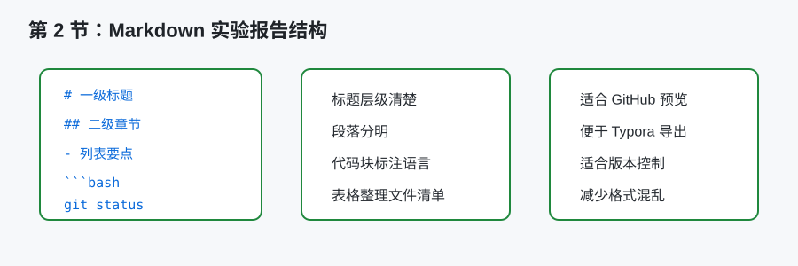
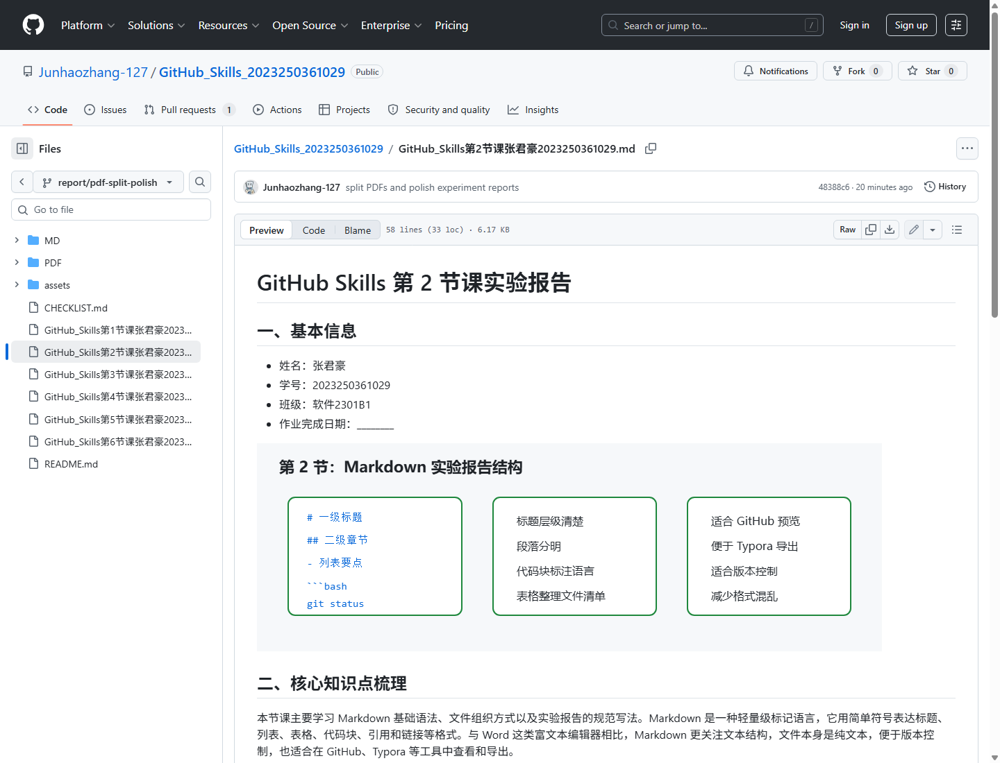

# GitHub Skills 第 2 节课实验报告

## 一、基本信息

- 姓名：张君豪
- 学号：2023250361029
- 班级：软件2301B1
- 作业完成日期：________



## 二、核心知识点梳理

本节课主要学习 Markdown 基础语法、文件组织方式以及实验报告的规范写法。Markdown 是一种轻量级标记语言，它用简单符号表达标题、列表、表格、代码块、引用和链接等格式。与 Word 这类富文本编辑器相比，Markdown 更关注文本结构，文件本身是纯文本，便于版本控制，也适合在 GitHub、Typora 等工具中查看和导出。

Markdown 标题使用 `#` 表示层级。一级标题通常用于文档标题，二级标题用于主要章节，三级标题用于小节。标题层级应当连续，不宜从一级标题直接跳到三级标题。列表可以分为有序列表和无序列表，适合整理步骤、要点和检查项。表格适合展示文件清单、任务状态和对比信息。代码块需要使用三个反引号包围，并标注语言，例如：

```bash
git status
git add .
git commit -m "add experiment report"
```

实验报告不仅要有格式，还要有内容组织。老师要求每份报告包含核心知识点梳理、学习中的难点、实践操作与收获、学习遇到的困惑与疑问四个核心部分。第 4 部分虽然属于选做，但如果认真填写，能够体现学习过程中的真实思考。报告的基本信息也很重要，因为它直接关系到作业识别和归档。

文件组织方面，本次作业需要在仓库根目录下放置 6 份 Markdown 报告、README.md 和 CHECKLIST.md。文件命名采用“课程名 + 第 X 节课 + 姓名 + 学号”的方式，虽然文件名较长，但信息完整，方便老师确认归属。使用统一命名规则也能减少后续整理 PDF 时的混乱。

## 三、学习中的难点

本节最大的难点是从“会写文字”转变为“会写结构化文档”。以前写实验报告时，更多关注内容本身，格式可以通过 Word 后期调整。但 Markdown 要求在写作时就考虑标题、段落、列表和代码块的关系。比如代码命令如果直接写在段落中，可读性会下降；放入 `bash` 代码块后，既清楚又便于复制。

第二个难点是标题层级的控制。Markdown 中 `#` 的数量代表标题级别，看起来简单，但如果随意使用，文档结构会变乱。实验报告的一级标题应只有一个，后面的“基本信息、核心知识点梳理”等部分使用二级标题，这样导出 PDF 或在 Typora 中查看大纲时会更清楚。

第三个难点是如何避免内容空泛。Markdown 能帮助排版，但不能自动提高报告质量。如果每份报告都只是写“我学习了 GitHub，感觉很有用”，即使格式正确，也不能体现学习过程。因此在写作时需要具体说明做了什么、遇到什么问题、怎样解决，以及由此得到什么认识。

## 四、实践操作与收获

实践中，我按照统一结构创建 Markdown 实验报告文件。每份报告都保留基本信息，并把作业完成日期设置为 `________`，避免自动填写当前日期。这样可以在最终提交前根据老师要求统一补充，防止日期不一致。文件名也严格按照要求保留中文姓名和学号，便于老师识别和归档。

在写 README.md 时，我使用 Markdown 表格整理 6 份报告的文件名、课程主题和完成状态。表格比普通列表更适合展示清单，因为它能让不同字段对齐，阅读时更直观。CHECKLIST.md 则使用任务列表语法 `- [ ]`，用于提交前逐项检查。这种写法让我认识到 Markdown 不只是写报告，也可以辅助项目管理。



上图是第 2 节实验报告在 GitHub 网页中的 Markdown 预览截图。通过预览页面可以检查标题层级、段落间距、代码块显示和图片引用是否正常，比只在本地编辑器中查看更接近最终提交后的展示效果。

我还练习了在报告中正确书写命令代码块。例如涉及 Git 操作时，使用 `bash` 标注代码块语言，而不是把命令混在正文中。这样做一方面符合 Markdown 格式要求，另一方面也能让读者明确哪些是命令、哪些是说明文字。

在文件组织上，我把所有作业文件放在仓库根目录，避免过深的目录结构。对于只有 6 份报告的课程作业来说，根目录表格索引已经足够清晰。如果以后作业数量增加，可以考虑按课程章节或实验类型建立文件夹，但本次作业不需要过度设计。

图示说明：上方图示总结了 Markdown 报告中最常用的结构元素，包括标题、列表、代码块和表格。若后续需要提供真实软件界面证据，可以在此处补充 Typora 打开 Markdown 报告的大纲截图，展示标题层级是否清楚。

## 五、学习遇到的困惑与疑问

我产生的第一个疑问是：Markdown 是否能够完全替代 Word？目前来看，Markdown 更适合结构清楚、格式相对简单的技术文档和实验报告；如果需要复杂页眉页脚、精细排版或大量图片排版，Word 仍然有优势。因此本课程选择 Markdown，是因为它更适合 GitHub 管理和后续版本控制。

第二个疑问是：代码块是否一定要标注语言？从显示效果看，不标注语言也能显示代码，但标注 `bash`、`markdown` 等语言可以提升可读性，也能让语法高亮更准确。对于课程报告来说，养成标注语言的习惯是更规范的做法。

第三个疑问是：中文文件名在 GitHub 中是否会有问题？实践中 GitHub 可以正常显示中文文件名，但在不同系统和命令行环境中，中文路径有时可能涉及编码问题。因此使用中文文件名时要注意 UTF-8 编码，避免文件名乱码。由于老师已经明确要求按指定格式命名，本次作业应遵守要求。

## 六、总结

通过第 2 节课，我掌握了 Markdown 的基本写法和实验报告的组织思路。Markdown 的价值不只是让文档好看，更重要的是让内容结构清楚、便于版本控制和在线展示。本节实践让我认识到，写实验报告不能只追求字数，还要关注标题层级、段落组织、代码块规范和文件命名规则。后续在编写 GitHub Skills 课程报告时，我会继续保持统一格式，并尽量让每份报告都有明确主题和真实思考。
