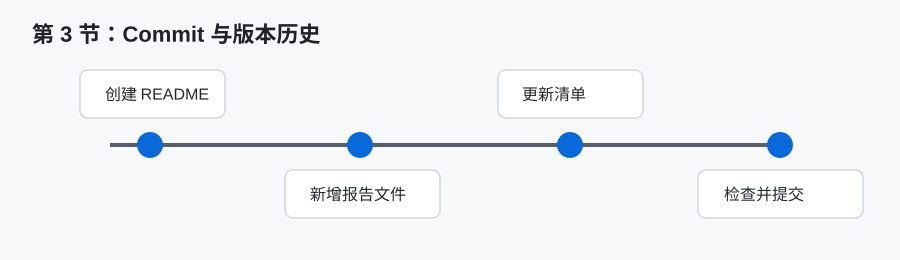

# GitHub Skills 第 3 节课实验报告

## 一、基本信息

- 姓名：张君豪
- 学号：2023250361029
- 班级：软件2301B1
- 作业完成日期：________



## 二、核心知识点梳理

本节课的重点是 Commit 提交、版本历史和变更追踪。Git 的核心价值之一就是记录项目的变化过程，而 commit 是这个过程中的基本单位。每一次 commit 都可以理解为对仓库当前状态的一次快照，包含修改内容、提交人、提交时间和提交说明。通过 commit 历史，可以了解项目从开始到现在经历了哪些变化，也可以在出现问题时定位修改来源。

Git 的常见工作流程包括查看状态、暂存文件、提交版本和查看历史。`git status` 用来查看当前工作区有哪些文件被修改、新增或删除；`git add` 用来把修改放入暂存区；`git commit` 用来把暂存区内容正式保存为一个版本；`git log` 可以查看提交历史。典型命令如下：

```bash
git status
git add .
git commit -m "add GitHub Skills experiment reports"
git log --oneline
```

工作区、暂存区和版本库是理解 Git 提交机制的关键。工作区是我们实际编辑文件的地方，暂存区是准备提交的内容集合，版本库则保存已经提交的历史记录。Git 不会自动把所有修改都提交，而是要求使用者明确选择哪些内容进入下一次 commit。这种设计可以让提交更有组织性。

提交信息也很重要。好的 commit 信息应该简洁说明本次修改的目的，例如 `add GitHub Skills experiment reports`。不规范的信息如 `update`、`111`、`final` 很难让别人理解修改内容。课程作业虽然规模不大，但仍应养成规范写提交信息的习惯。

## 三、学习中的难点

本节的第一个难点是理解为什么需要暂存区。刚开始我觉得修改文件后直接提交就可以，为什么还要多一步 `git add`。学习后发现，暂存区可以让我们把多个文件的修改分批组织到不同 commit 中。例如 README 和实验报告可以一起提交，也可以根据任务拆成多个提交。暂存区让版本历史更可控。

第二个难点是判断一次 commit 应该包含多少内容。如果每改一行就提交，历史会过于零散；如果所有修改都堆在一次 commit 中，又不利于回顾和定位问题。比较合理的做法是按任务或功能提交。例如本次作业可以把“创建 6 份实验报告、更新 README、添加 CHECKLIST”作为一个完整任务提交。

第三个难点是理解版本历史的用途。以前我可能只把 Git 当作上传工具，认为提交只是为了把文件放到 GitHub 上。但实际上 commit 历史可以帮助回退错误、比较版本、审查修改，也能体现作业完成过程。特别是在团队协作中，清楚的历史记录比单个最终文件更有价值。

## 四、实践操作与收获

在实践中，我先查看仓库状态，确认当前有哪些文件需要创建或修改。随后创建 6 份实验报告、更新 README，并添加 CHECKLIST。完成编辑后，再通过 Git 状态检查确认这些文件都被 Git 识别。这个过程让我意识到，提交前查看状态是一种必要习惯，不能凭感觉认为所有文件都已经准备好。

我还练习了使用统一的提交信息。本次要求 commit 信息为 `add GitHub Skills experiment reports`，它能够清楚说明本次提交的主要内容。相比随意写“作业”或“完成”，这个信息更适合出现在版本历史中。以后查看提交记录时，可以快速知道这次提交是添加 GitHub Skills 实验报告。

在理解变更追踪时，我认识到 Git 不只是保存最终文件，还能保存修改过程。如果后续发现某份报告内容有误，可以通过历史记录查看当时是如何修改的；如果 README 表格不小心被改坏，也可以从历史版本中恢复。这样的能力对于长期维护文档和代码都很重要。

实践中也要注意不要把无关文件提交到仓库。例如本地可能存在临时文件、导出的 PDF、编辑器缓存等。如果不加检查就执行 `git add .`，可能会把无关内容一起提交。虽然本次作业要求 .gitignore 为 None，但这不代表可以随意提交所有本地文件。提交前仍应检查文件清单。

图示说明：上方时间线展示了从 README 到报告文件再到检查清单的版本演进思路。若后续需要提交真实操作证据，可以在此处补充 `git status` 或 GitHub 提交历史页面截图，展示提交前后的状态变化。

## 五、学习遇到的困惑与疑问

我比较困惑的是：如果已经提交了错误内容，应该如何处理？目前了解到有多种方法，例如继续提交一个修复 commit，或者在特定情况下使用回退命令。对于课程作业来说，如果错误已经推送到远程仓库，通常更稳妥的方式是新增一次修复提交，而不是强行改写历史。

另一个疑问是：commit 信息应该用中文还是英文？从课程作业角度看，中文可以表达清楚；从开源社区和工具习惯看，英文短语更常见。本次老师指定了英文提交信息，因此应按要求执行。我认为最重要的是信息清楚、准确、可理解，而不是机械追求某一种语言。

我还在思考 `git add .` 是否总是合适。它很方便，但也可能把所有未跟踪文件都加入暂存区。如果仓库中存在不应提交的文件，使用 `git add .` 就有风险。更规范的做法是在提交前先运行 `git status`，必要时使用 `git add README.md` 或指定文件名进行暂存。

## 六、总结

通过第 3 节课，我理解了 commit 在 Git 中的核心地位，也认识到版本历史不是形式上的记录，而是项目管理和协作的重要依据。一个好的提交应该内容集中、信息清楚、范围明确。本节实践让我从“把文件上传到 GitHub”转变为“用 Git 管理修改过程”。后续进行分支和 Pull Request 学习时，commit 历史也会成为协作审查的重要基础。
