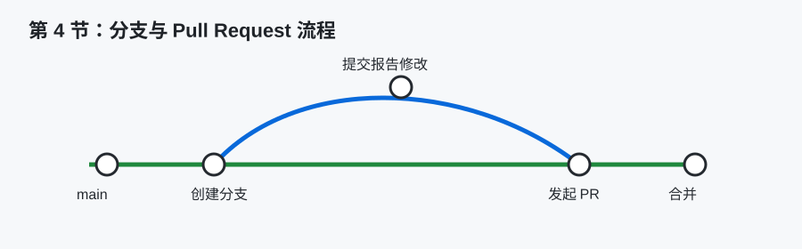
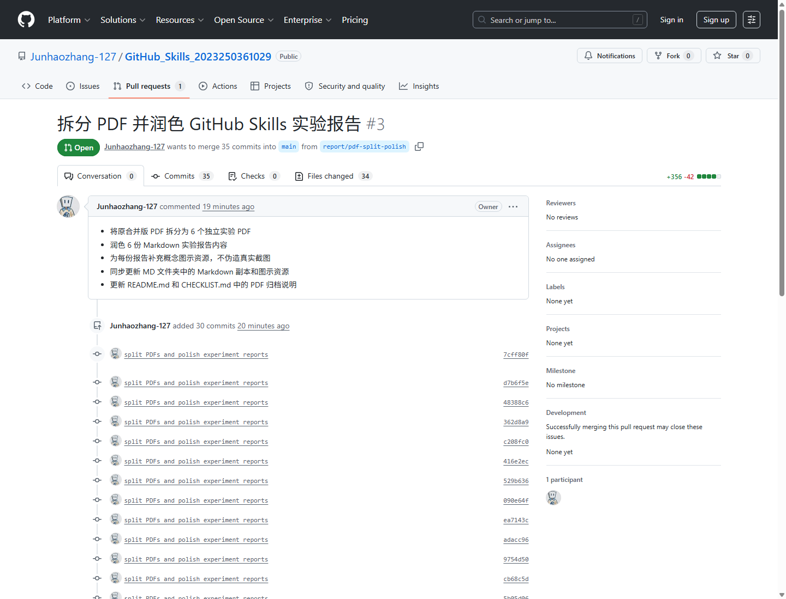

# GitHub Skills 第 4 节课实验报告

## 一、基本信息

- 姓名：张君豪
- 学号：2023250361029
- 班级：软件2301B1
- 作业完成日期：________



## 二、核心知识点梳理

本节课主要学习 Branch 分支管理和 Pull Request 协作流程。分支是 Git 中非常重要的概念，它允许我们在不直接影响主分支的情况下进行修改。主分支通常保存相对稳定的内容，而新功能、实验报告修改或问题修复可以放在单独分支中完成。完成并检查后，再通过合并把修改带回主分支。

创建分支的常见命令如下：

```bash
git checkout -b report/github-skills-homework
git status
git push -u origin report/github-skills-homework
```

Pull Request 简称 PR，是 GitHub 上进行代码审查和合并的重要机制。它不是简单的“提交按钮”，而是一个讨论、检查和合并修改的过程。创建 PR 时通常需要填写标题和描述，说明本次修改包含哪些内容、为什么修改、是否还有未完成事项。其他人可以在 PR 中查看文件差异、评论、提出修改建议，最后再决定是否合并。

分支和 PR 的配合能够降低直接修改主分支带来的风险。对于课程作业来说，虽然只有个人完成，也可以通过新分支和 PR 模拟真实协作流程。这样做能够展示自己理解了 GitHub 的标准工作方式，而不是只会在网页上直接编辑文件。

## 三、学习中的难点

本节的第一个难点是理解分支的意义。刚开始可能会觉得只有一个人做作业，没有必要创建分支。但学习后我意识到，分支不只是多人协作才需要，个人开发中也很有用。它可以把正在修改的内容和稳定版本隔离开，避免未完成的修改直接影响主分支。

第二个难点是 Pull Request 与直接提交的区别。直接提交到 main 分支速度快，但缺少检查和讨论过程。PR 则提供了一个缓冲区，可以在合并前查看所有变更。尤其是当修改文件较多时，PR 的文件差异页面可以帮助发现遗漏、格式问题和不必要的修改。

第三个难点是分支命名。分支名需要表达任务含义，例如 `report/github-skills-homework` 表示这是课程报告作业分支。相比 `test`、`new` 这类名称，规范分支名能让别人快速理解分支用途，也便于后续管理。如果项目分支很多，命名混乱会明显增加沟通成本。

## 四、实践操作与收获

本次实践中，我优先创建新分支 `report/github-skills-homework`，并在该分支上完成实验报告相关文件的创建与整理。这样主分支保持原状，作业内容集中在独立分支中。完成后再提交 commit，并通过 Pull Request 向 main 分支提出合并请求。

在准备 PR 描述时，我把本次修改内容概括为：创建 6 份实验报告、创建 README.md、创建 CHECKLIST.md、作业完成日期暂未填写、后续可用 Typora 导出 PDF。这种描述方式比只写“完成作业”更清楚，也方便老师或自己回顾本次 PR 的范围。



上图是本仓库 Pull Request 页面的实际截图。页面中可以看到 PR 标题、目标分支、来源分支、提交记录和文件变更入口，这些信息共同构成了合并前的检查依据。通过 PR 页面，我能在合并前集中查看修改范围。

通过这个过程，我认识到 PR 的价值在于“让修改可审查”。如果直接把所有文件放进 main 分支，虽然也能完成作业，但缺少一个集中查看差异的入口。PR 页面可以展示新增文件、修改内容、提交记录和讨论记录，符合现代软件开发中的协作习惯。

我还注意到，在个人仓库中使用 PR 也能帮助自我检查。例如提交后进入 PR 的 Files changed 页面，可以逐个查看 Markdown 文件是否缺少标题、是否误填日期、是否存在格式问题。即使没有其他同学参与审查，这个过程也能提高提交质量。

图示说明：上方图示展示了从 main 分支创建作业分支、提交修改、发起 PR 到合并的基本路径。若后续需要提交真实操作证据，可以在此处补充 Pull Request 页面截图，展示分支名、PR 标题和文件差异。

## 五、学习遇到的困惑与疑问

我比较疑惑的是：什么时候应该创建分支，什么时候可以直接在 main 上修改？目前我的理解是，如果只是修正一个很小的错别字，并且项目规则允许，直接修改可能可以接受；但如果涉及多个文件、作业提交、新功能或可能影响主线内容的修改，使用分支和 PR 更稳妥。

另一个问题是：PR 合并后分支是否需要删除？在实际项目中，已经合并的功能分支通常可以删除，避免分支列表越来越乱。但如果课程需要保留分支作为作业过程证据，也可以暂时保留。是否删除应根据课程要求或项目规范决定。

我还在思考 PR 审查主要看什么。除了代码是否能运行，文档类作业也需要审查标题层级、文件命名、内容完整性、是否有无关文件、是否误填日期等。也就是说，PR 审查并不只适用于程序代码，同样适用于报告和说明文档。

## 六、总结

通过第 4 节课，我理解了分支和 Pull Request 在 GitHub 协作中的作用。分支让修改过程与主分支隔离，PR 让修改过程可检查、可讨论、可追踪。即使本次作业由个人完成，使用分支和 PR 仍然有助于模拟真实开发流程，也能让作业提交更规范。本节学习让我认识到，GitHub 的价值不仅在于保存文件，还在于提供了一整套协作流程。
