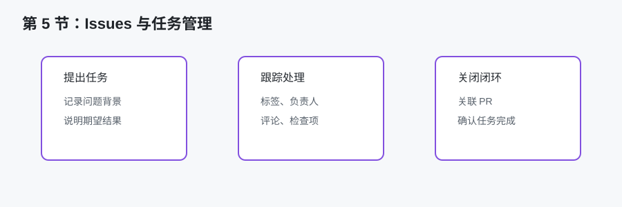
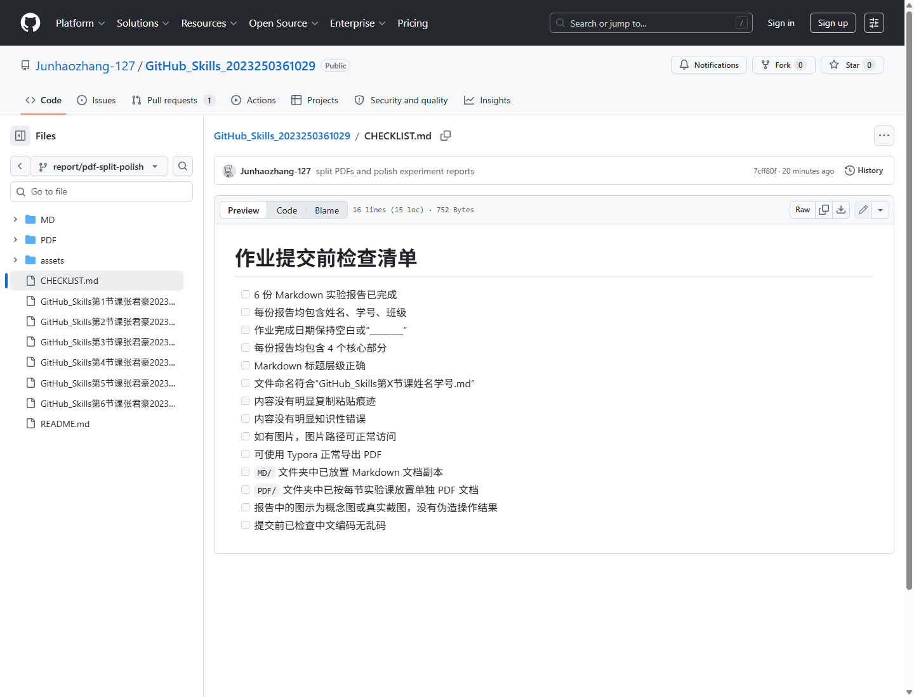

# GitHub Skills 第 5 节课实验报告

## 一、基本信息

- 姓名：张君豪
- 学号：2023250361029
- 班级：软件2301B1
- 作业完成日期：2026年6月9日
- 仓库地址：[https://github.com/Junhaozhang-127/GitHub_Skills_2023250361029](https://github.com/Junhaozhang-127/GitHub_Skills_2023250361029)

## 二、核心知识点梳理

本节课主要学习 Issues、项目任务管理与协作沟通。Issues 是 GitHub 中用于记录问题、任务、需求和讨论的重要功能。它既可以用于软件项目中的 bug 反馈，也可以用于课程作业中的任务拆分和进度记录。一个 Issue 通常包括标题、正文、标签、负责人、评论和状态等信息。

Issues 的价值在于把零散的问题变成可追踪的任务。例如“补充第 3 节课报告内容”“检查 README 表格”“确认作业完成日期是否填写”等事项，都可以用 Issue 记录。相比把任务记在聊天记录或纸上，Issue 更容易和仓库文件、提交记录、Pull Request 关联起来。

项目管理中常用的概念包括任务拆分、优先级、状态跟踪和沟通记录。GitHub Issues 可以配合 labels 标记类型，例如 documentation、bug、question 等；也可以使用 assignees 指定负责人；还可以通过评论记录讨论过程。对于多人协作项目，这些功能能减少口头沟通遗漏。

本节还涉及沟通表达的规范。一个好的 Issue 标题应当简洁明确，正文应说明背景、期望结果和可能的处理方式。例如标题写“补充 CHECKLIST 提交前检查项”比写“问题”更有意义。沟通清楚本身也是软件工程能力的一部分。

## 三、学习中的难点

本节的第一个难点是理解 Issue 和 Pull Request 的区别。Issue 更偏向记录问题或任务，PR 更偏向提交具体修改。一个 Issue 可以先提出“需要补充实验报告”，然后通过一个 PR 来解决它。PR 合并后，可以关闭对应 Issue。二者配合使用，能让问题提出、修改实现和结果确认形成闭环。

第二个难点是避免 Issue 过于随意。如果标题和描述都很模糊，Issue 就失去了管理价值。例如只写“改一下”很难让别人知道要改什么。比较好的写法是说明具体文件、具体问题和期望结果。即使是个人作业，也应该练习这种清楚表达。

第三个难点是任务拆分的粒度。任务太大时，Issue 难以推进；任务太小时，Issue 数量又会过多。对于本次 6 份实验报告，可以按“创建报告文件”“完善 README”“提交前检查”这样的粒度拆分，而不必为每一段文字创建一个任务。

## 四、实践操作与收获

在本次课程作业整理过程中，我把 CHECKLIST.md 作为一种轻量任务管理文件。虽然它不是 GitHub 网页中的 Issue，但它体现了类似的检查思想：把提交前容易遗漏的事项列成清单，并逐项确认。例如检查 6 份报告是否完成、基本信息是否一致、作业完成日期是否保持空白、Markdown 标题层级是否正确、文件命名是否符合要求。

上图是 CHECKLIST.md 在 GitHub 网页中的预览截图。它把作业提交前的检查事项可视化为清单，作用类似轻量级任务管理页面，能够帮助我避免漏交文件、误填日期或忽略 Markdown 格式问题。

如果使用 GitHub Issues，可以进一步把这些检查项拆分成任务。例如创建一个 Issue，标题为“检查 6 份 GitHub Skills 实验报告格式”，正文列出需要确认的项目。完成检查后，在 PR 中引用该 Issue，形成从任务提出到修改完成的记录。这个流程让我理解到，Issues 并不只是报告 bug，它也可以用于课程作业和文档管理。

我还认识到，沟通记录对团队协作非常重要。很多时候问题不是技术不会，而是没有说明清楚。例如“第 4 节课需要写 PR 流程”这个要求，如果只记在脑子里，很容易遗漏；写成 Issue 或 checklist 后，任务就变得具体可见。对于课程小组作业，Issues 可以帮助成员分工，也方便老师了解每个人参与情况。

在实践收获方面，我认为本节让我从“完成文件”进一步转向“管理任务”。当作业文件数量增加时，光靠记忆很容易出错。使用 Issues、README 表格和 CHECKLIST，可以让作业状态更加清楚，也能减少提交前的紧张和返工。

图示说明：上方图示把 Issues 的任务闭环概括为提出任务、跟踪处理和关闭确认。若后续需要提交真实操作证据，可以在此处补充 GitHub Issues 页面或 CHECKLIST.md 页面截图，展示任务管理方式。

## 五、学习遇到的困惑与疑问

我比较困惑的是：个人作业是否真的需要 Issues？从效率上看，简单作业可能不需要创建很多 Issue；但从学习 GitHub 协作流程的角度看，至少了解 Issue 的作用是必要的。它可以帮助我们把问题管理起来，而不是只依赖聊天或口头说明。

另一个疑问是：Issue 是否必须和代码修改绑定？学习后我理解到不一定。Issue 可以是问题、建议、讨论或计划，不一定马上对应代码修改。但如果 Issue 最终通过某个 PR 解决，把它们关联起来会更清楚。

我还在思考如何写出高质量的 Issue。一个有价值的 Issue 应该包含背景、现象、预期结果和补充信息。对于文档任务，也可以包含涉及文件、检查标准和完成条件。这样别人看到后才能快速判断如何处理，而不需要反复追问。

## 六、总结

通过第 5 节课，我理解了 GitHub Issues 在任务管理和协作沟通中的作用。Issues 可以把问题、需求和待办事项变成可追踪记录，配合 PR 能形成完整的工作闭环。本节实践让我认识到，软件工程不仅是写代码或写报告，还包括任务拆分、状态检查和清晰沟通。对于本次课程作业，README、CHECKLIST 和 PR 描述都体现了这种管理思想。
